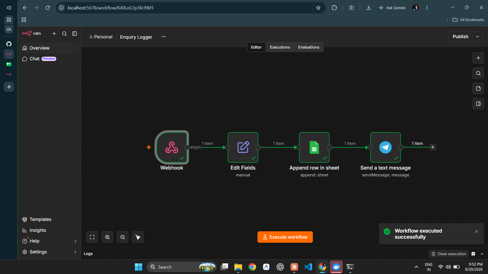
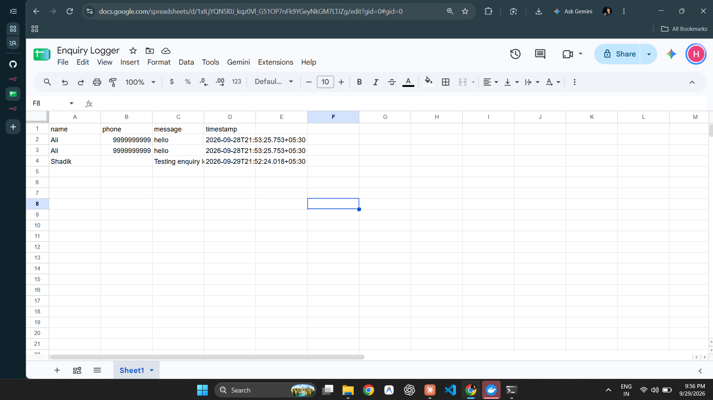

<div align="center">

# 🤖 AI Automation Internship (Virtual)

### *Learning how real internships work, by doing one end to end*


</div>

---

## 👋 About this repo

Hi, I'm **Shadik Shaik**, a first-year B.Tech CSE student at Mallareddy University, Hyderabad.

As a first-year, real internships are hard to get. Many offers that land in my inbox are actually **"pay for training, then get a free internship"** scams, and I don't want to fall for those. So I built my own path: a **virtual internship with the same structure as a real one**, where **Claude acts as my mentor/HR**.

This repo is my proof of work: every task, note, workflow and report lives here.

> ⚠️ **Honesty note:** This is a **self-directed, simulated internship** with a fictional company (*NovaLoop Labs*). It is **not** an employment record. The real value is the projects and reports you can see in this repo.

---

## 🧾 Internship at a glance

| | |
|---|---|
| 👤 **Intern** | Shadik Shaik |
| 💼 **Role** | AI Automation Intern (Virtual) |
| 🏢 **Company** | NovaLoop Labs (fictional) |
| 🧑‍🏫 **Mentor / HR** | Claude |
| 📅 **Duration** | 28 Sep 2026 → 25 Oct 2026 (4 weeks) |
| 🎯 **Goal** | Build one working automation product for my portfolio |

---

## 🎯 What I'm learning

- ⚡ How automation works: **Trigger → Process → Action**
- 🔗 Building workflows with **n8n**, Google Sheets, Telegram and email
- 🧠 Adding an **AI step** (classify / auto-reply) to a workflow
- 🧪 Testing, error handling and documentation
- 📝 Working like a professional: weekly tasks, reports, reviews, deadlines

---

## 🗺️ 4-Week Roadmap

| Week | Dates | Theme | Deliverable | Status |
|:---:|---|---|---|:---:|
| **1** | 28 Sep – 3 Oct | Onboarding + fundamentals | Repo, notes, starter workflow, report | 🟡 In progress |
| **2** | 5 Oct – 10 Oct | Project kickoff | Problem statement, design diagram, v0.1 | ⚪ Upcoming |
| **3** | 12 Oct – 17 Oct | Build + AI layer | AI step, error handling, test log | ⚪ Upcoming |
| **4** | 19 Oct – 25 Oct | Polish + final review | Demo, final report, presentation, certificate | ⚪ Upcoming |

---

## ✅ Week 1 Task Tracker

- [x] **Task 1:** Create this repo + README
- [ ] **Task 2:** Fundamentals note (`notes/what-is-automation.md`)
- [ ] **Task 3:** Starter workflow, *Enquiry Logger* (`workflows/enquiry-logger.json`)
- [ ] **Task 4:** Weekly report (`reports/week1.md`)

---

## 🚀 Main Project (revealed in Week 2)

A **lead-capture and auto-reply system** for a small business:

```
📥 Customer enquiry  →  🧹 Clean + log data  →  🤖 AI understands it  →  💬 Auto-reply + 🔔 Owner alert
```

---

## 📁 Repo Structure

```
Ai-Automation-Internship/
├── README.md            ← you are here
├── notes/               ← my learning notes
├── workflows/           ← exported n8n workflows + screenshots
└── reports/             ← weekly reports
```

---

## 📓 Daily Log

| Day | Date | What I did |
|:---:|---|---|
| 1 | 28 Sep | Got the onboarding pack, created the repo, wrote this README |


## Progress
| Task | Status |
|------|--------|
| Task 1: Repo + README | ✅ Done |
| Task 2: What is automation (notes) | ✅ Done |
| Task 3: Enquiry Logger workflow | ✅ Done: [notes](notes/enquiry-logger-notes.md), [workflow](workflows/enquiry-logger.json) |

## Screenshots



## 📬 Connect with me

[](https://github.com/Shaikshadik03)
[](https://shaikshadik03.github.io/PROTFOLIO)

<div align="center">

⭐ *Learning by building, one small step at a time.* ⭐

</div>
